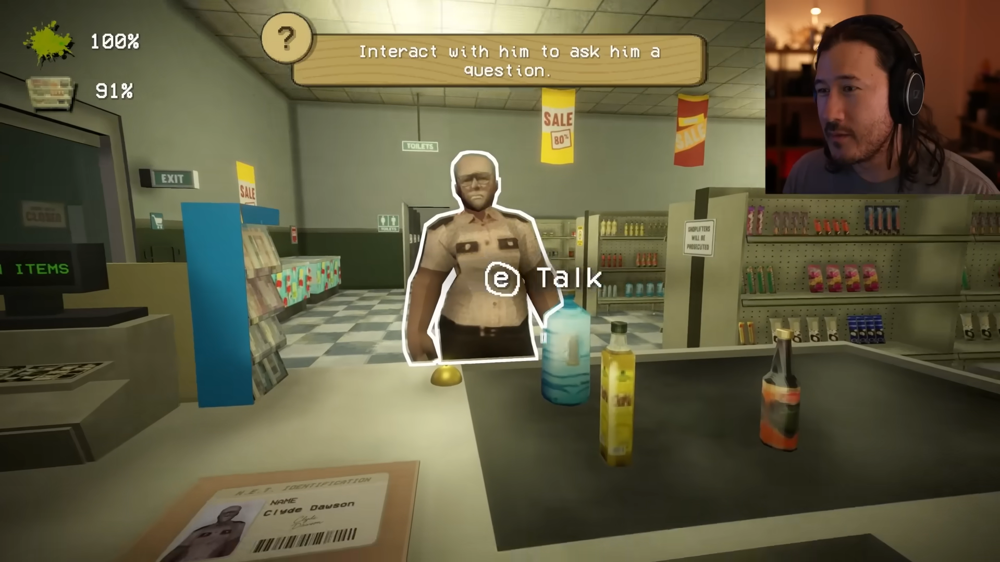
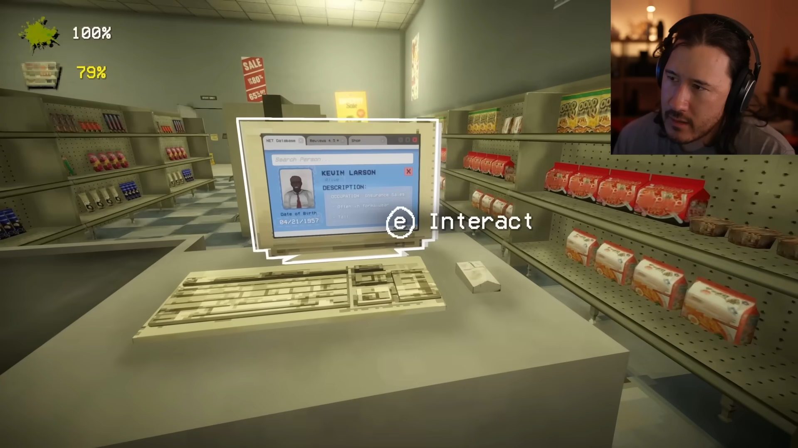
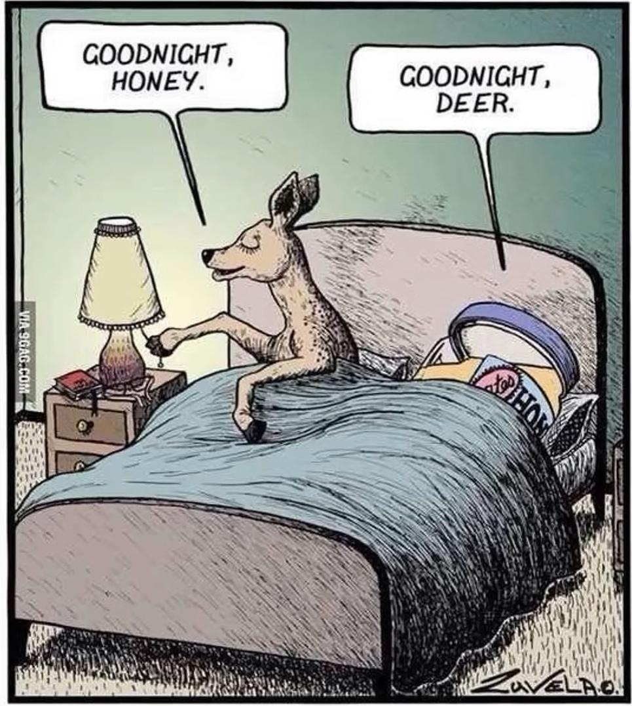
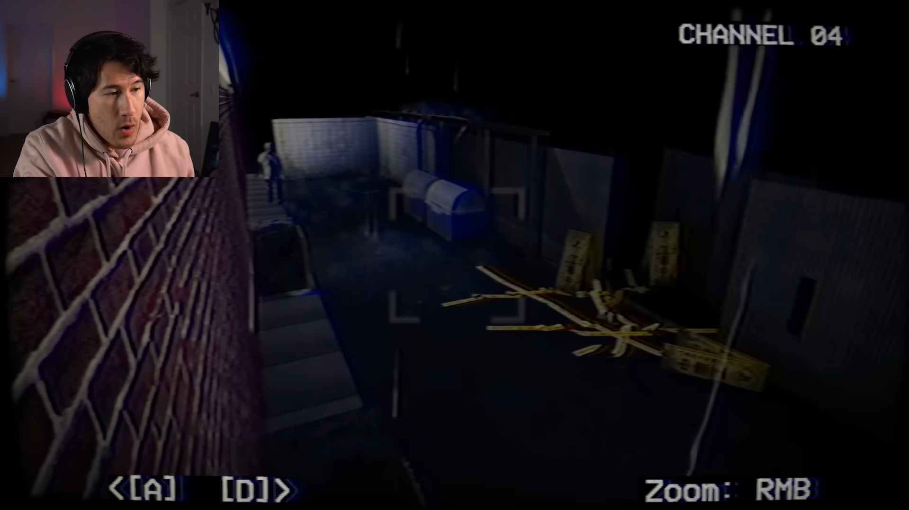

# Especificação da Implementação

> [!CAUTION]
> - Você <ins>**não pode utilizar ferramentas de IA para escrever esta
>   especificação**</ins>

> [!WARNING]
> - Após a entrega da primeira versão completa, esta especificação não
>   poderá ser alterada. A implementação final deverá corresponder ao que
>   estiver descrito neste arquivo.

## Integrantes da dupla

- **Aluno 1 - Nome**: <mark>`Joel Soares González`</mark>
- **Aluno 1 - Cartão UFRGS**: <mark>`00550073`</mark>

- **Aluno 2 - Nome**: <mark>`Nickolas Xisto Machado`</mark>
- **Aluno 2 - Cartão UFRGS**: <mark>`00341038`</mark>

## Detalhes do que será implementado

- **Título do trabalho**: <mark>`INFNAF`</mark>
- **Parágrafo curto descrevendo o que será implementado**: <mark>`A aplicação será um jogo de terror ambientado na secretaria do Diretório Acadêmico da Computação, a "lojinha do DACOMP". Neste jogo, o jogador é um bolsista resposável por atender clientes à noite. Entretanto, além de clientes normais, haverão monstros tentando entrar que devem ser evitados. Alguns podem se disfarçar como clientes e você deve negar seu atendimento, caso não o faça, irão lhe assustar e após três falhas, matá-lo. Contudo, se negar muitos clientes reais, será desligado da bolsa. Um monstro tentará entrar pelas janelas que estão abertas pra sair o cheiro do banheiro que fica em cima. Quando ver algo estranho em uma das janelas, o jogador deverá fechá-la até que a anomalia desapareça. Se a anomalia permanecer por determinado tempo, o monstro entra e o jogo acaba. Um outro monstro tentará entrar pela porta lentamente. O bolsista deve ficar atento à câmera de segurança em frente para vê-lo se aproximar e então fechar a porta, apagar as luzes e não fazer barulho até que o monstro vá embora. Porém, manter a porta fechada impede clientes de entrar e será tratado como negar serviço.`</mark>

## Especificação visual

### Vídeo - Link

> [!IMPORTANT]
> - Coloque aqui um link para um vídeo que mostre a aplicação gráfica
>   de referência que você vai implementar. **Sua implementação deverá
>   ser o mais parecido possível com o que é mostrado no vídeo (mais
>   detalhes abaixo).**
> - **Você não pode escolher como referência: (1) algum trabalho realizado
>   por outros alunos desta disciplina, em semestres anteriores. (2) Minecraft.**
> - Por exemplo, você pode colocar um vídeo de um jogo que você gosta,
>   e seu trabalho final será uma re-implementação do jogo.
> - O vídeo pode ser um link para YouTube, Google Drive, ou arquivo mp4 dentro
>   do próprio repositório. Mas, garanta que qualquer um tenha
>   permissão de acesso ao vídeo através deste link.

[Gameplay de referência](https://youtu.be/5bpZJVoFZas?si=vVcQ7qBq7t119JRP)

### Vídeo - Timestamp

> [!IMPORTANT]
> - Coloque aqui um **intervalo de ~30 segundos** do vídeo acima, que
>   será a base de comparação para avaliar se o seu trabalho final
>   conseguiu ou não reproduzir a referência.

- **Timestamp inicial**: <mark>6:35</mark>
- **Timestamp final**: <mark>7:03</mark>

### Imagens

> [!IMPORTANT]
> - Coloque aqui **três imagens** capturadas do vídeo acima, que você
>   irá usar como ilustração para as explicações que vêm abaixo.
> - As imagens devem estar armazenadas neste repositório, no diretório
>   `images/spec/`, com os nomes `image1`, `image2` e `image3`.
> - Cada imagem deve usar o formato `.jpg` ou `.png`. Ajuste a extensão
>   nos vínculos abaixo para que corresponda ao arquivo armazenado.
> - Escolha imagens que correspondam a momentos do intervalo indicado
>   acima ou que sejam relevantes para a comparação com a implementação.

#### Imagem 1

- **Descrição**: Na imagem 1 temos uma referência geral de estilo visual, com texturas simples, modelos "low-poly" e iluminação local com bloom. É possível ver as prateleiras com produtos à disposição. Essa imagem também ilustra a interação com clientes. Um cliente traz itens até a bancada e lhe entrega sua identificação. O jogador deve interagir com os produtos e escanear a identificação para verificar se é humano. Ao falar com o cliente, se suspeitar que não é humano, você poderá dispensá-lo.

#### Imagem 2

- **Descrição**: Nesta imagem temos o computador onde você pode conferir se as informações registradas batem com o cliente à sua frente, incluindo retrato e informações pessoais.

#### Imagem 3

- **Descrição**: Nesta imagem, possuímos uma referência visual de quando as luzes estão apagadas, exemplificando o bolsista fechando a loja para evitar o monstro. Também é possível ver um medidor de barulho que aumenta quanto mais o jogador se mexe. Se o medidor encher o monstro entrará mesmo que a porta esteja fechada e as luzes apagadas.

#### Imagem 4 REFERÊNCIA EXTRA

- **Descrição**: DISCLAIMER: Esta imagem vêm de outro vídeo/jogo, mas serviu de inspiração. A ideia é acessar a câmera pelo computador para verificar o lado externo e antecipar o monstro pelo qual é necessário apagar as luzes e fechar a porta.

## Especificação textual

Para cada um dos requisitos abaixo (detalhados no [Enunciado do Trabalho final - Moodle](https://moodle.ufrgs.br/mod/assign/view.php?id=6302370)), escreva um parágrafo **curto** explicando como este requisito será atendido, apontando itens específicos do vídeo/imagens que você incluiu acima que atendem estes requisitos.

### Malhas poligonais complexas
O jogo terá um espaço 3D com diversos objetos variados, como produtos, estantes, cadeiras.

### Transformações geométricas controladas pelo usuário
O usuário poderá se mover e interagir com objetos dentro do cenário, como portas e janelas para abrir e fechá-las.

### Diferentes tipos de câmeras
A modalidade principal será uma câmera em primeira pessoa, sendo possível alterar para uma câmera externa fixada. A alternância entre câmeras ocorre através da interação com o computador.

### Instâncias de objetos
Os produtos expostos nas estantes  devem possuir mais de uma instância em posições diferentes.

### Testes de intersecção
O personagem controlado pode se mover pelo espaço virtual e serão implementadas colisões com elementos do cenário como paredes, mesas, etc. Os personagens que entrarem na loja também devem possuir colisão, não permitindo que o jogador os atravesse.

### Modelos de Iluminação em todos os objetos
Será utilizado um modelo de iluminação local, como Blinn-Phong, distinguindo os objetos e seus materiais.

### Mapeamento de texturas em todos os objetos
Os elementos do cenário virtual como os produtos, estantes, paredes, etc; bem como os personagens não jogáveis terão suas própias texturas.

### Movimentação com curva Bézier cúbica
A curva de Bézier será implementada na movimentação dos personagens não jogáveis. Seu caminho através da cena será definido por uma curva.

### Animações baseadas no tempo ($\Delta t$)
Para evitar variação dependendo da velocidade de processamento, a lógica de movimentação será implementada considerando o tempo em vez de quadros.

### Funcionalidade extra obrigatória

> [!IMPORTANT]
> - Descreva a funcionalidade extra relacionada à Computação Gráfica
>   que será implementada.
> - Esta funcionalidade também deverá ser documentada no arquivo
>   `README.md` da entrega final.

Para possibilitar a interação do jogador com objetos do cenário, será utilizado a seleção de objetos  com o mouse (Picking) utilizando o centro da tela como referência para o raio, limitando também o alcance da seleção.

## Limitações esperadas

> [!IMPORTANT]
> - Coloque aqui uma lista de detalhes visuais ou de interação que
>   aparecem no vídeo e/ou imagens acima, mas que você **não pretende
>   implementar** ou que você **irá implementar parcialmente**.
> - Para cada item, **explique por que** não será implementado ou por
>   que será implementado parcialmente.
As limitações listadas a seguir se devem primariamente pelo desejo de incorporar mecânicas distintas em um jogo original em vez de apenas uma releitura. Desta forma, tentaremos manter a compatibilidade visual com a referência do vídeo alterando elementos como jogabilidade e cenário.
 - O mapa não será o mesmo utilizado pelo jogo, sendo uma recriação do ambiente da secretaria do DACOMP, pois gostaríamos de ambientar o jogo no INF.
 - Algumas mecânicas como limpeza e estoque de produtos, visíveis nas imagens 1 e 2 no canto superior esquerdo, ou o sistema de questionar os clientes não serão implementadas. Em seu lugar, implementaremos o monitoramento da câmera e a necessidade de fechar as janelas e/ou a porta.